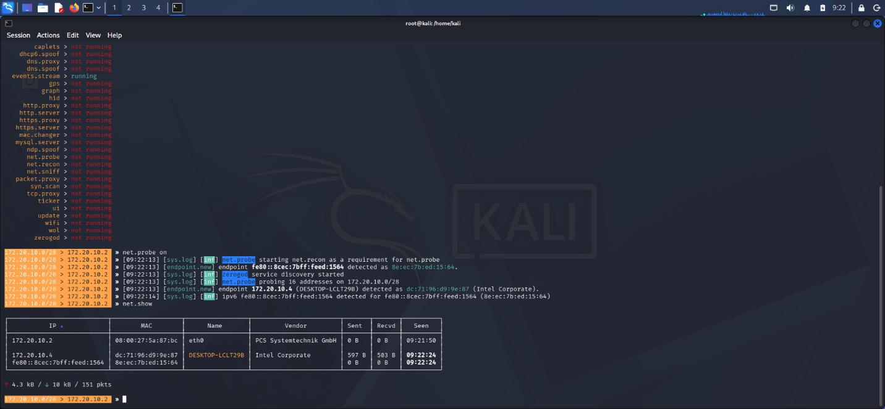
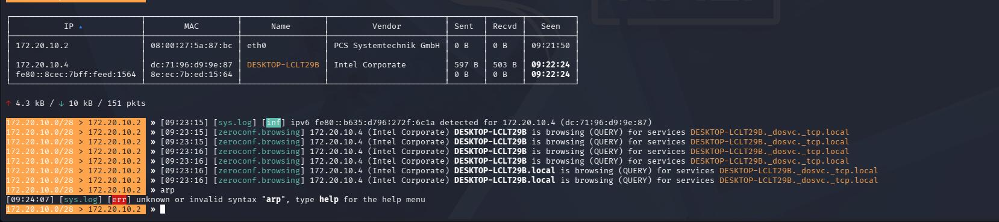

# Packet Sniffing Attack Demonstration Using Bettercap on a Victim Machine

---

## Bettercap Discovers the Windows Host

Bettercap was started on the Kali Linux VM with the `net.probe` module enabled. The tool successfully scanned the local subnet **172.20.10.0/28**.

It discovered the Windows machine:
* **Hostname:** DESKTOP-LCLT29B
* **IPv4 Address:** 172.20.10.4
* **Vendor:** Intel Corporation
* **MAC Address:** dc:71:96:d9:9e:87

The `net.show` command displayed all detected devices on the network, confirming communication between Kali and the Windows host.

---

## Windows Host (Brave Browser)

The Brave browser is open, indicating the host system is active on the network. This machine acts as the target (victim) system that will be discovered by Bettercap from the Kali Linux VM.

---

## Bettercap Service Discovery

* Bettercap continued monitoring the discovered Windows system.
* The **ZeroConf/mDNS** service detected the Windows hostname **DESKTOP-LCLT29B.local**.
* Network service discovery messages confirmed that the host was actively advertising services on the local network.
* An attempt to run the command `arp` returned an **"unknown or invalid syntax"** error because `arp` is not a valid Bettercap command.
* This demonstrates that Bettercap successfully identified the target device and monitored its network activity.
